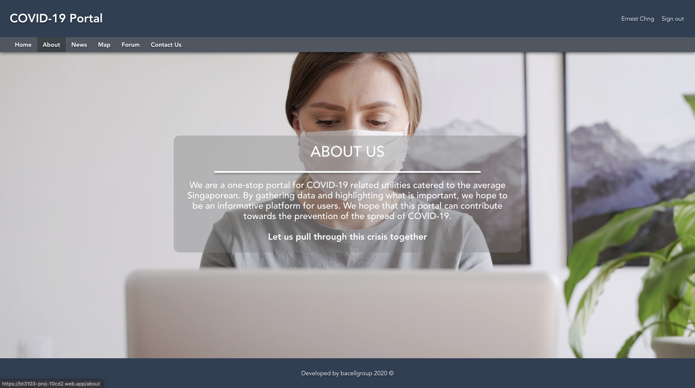

# BT3103 Project - COVID-19 Dashboard

## Description

COVID-19 Dashboard made using VueJS and Firestore database. See below for more information on the dashboard.

## Project setup

```
npm install
```

### Compiles and hot-reloads for development

```
npm run serve
```

### Compiles and minifies for production

```
npm run build
```

### Lints and fixes files

```
npm run lint
```

### Customize configuration

See [Configuration Reference](https://cli.vuejs.org/config/).

## COVID-19 Dashboard

Try it out here: https://bt3103-proj-10cd2.web.app/

Please register an account to receive full access to the dashboard.

### Home page

- A general welcome page before authenticated users begin their use


### Register page

- A registration page for users to create an account by filling in their particulars (email and password)


### Login page

- A login page that prompts the user’s email and password for Firestore authentication


### About page

- A page that expresses our mission and goals



### News page

- Provides the latest COVID-19 news updates (such as the most recently reported number of cases and fatalities in
  Singapore, the locations visited by COVID-19 cases, etc.)


### Map page

- Displays a map of Singapore that provides location-specific data of healthcare institutions
- Includes dropdowns/tabs to filter by Polyclinics, GPs (General Practitioner) and SASH (Swab and Send Home), and even
  SASH for children


### Forum page

- Provide a safe space for users to interact and discuss common topics for COVID-19
- Forum will be regularly maintained by the admin team as moderators to discourage any undesired behaviour such as
  cyberbullying, fake news and unrelated posts


### Contact page

- A dedicated page that provides a means for users to interact with the developers and product owner
- Users can provide feedback such as suggesting improvements, reporting bugs/glitches in the system, etc.

